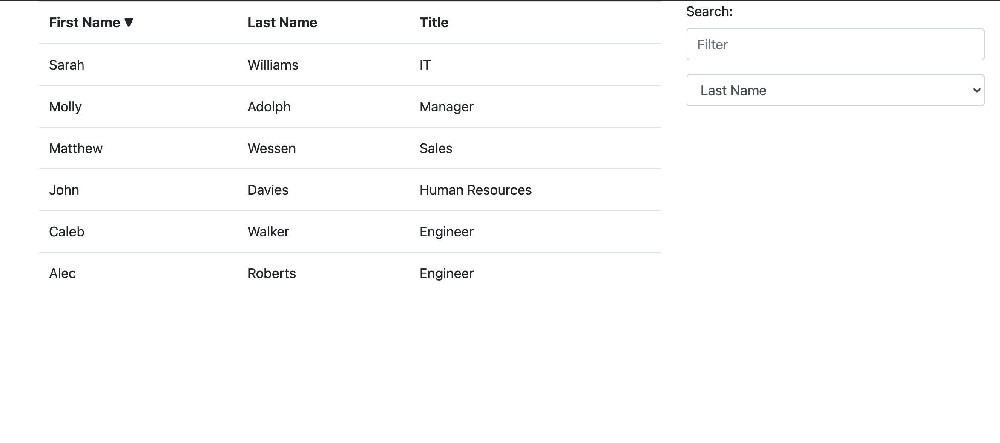

# EmployeeDirectory

## Description
This app was created with React.js, and demonstrates simple sorting and filtering of a list of employees.

## Table of Contents

1. [Screenshot](#screenshot)
2. [How to Use](#usage)
3. [Questions](#questions)

## Screenshot

## How to Use

To use, simply navigate to the site! [Link](https://calebkw91.github.io/EmployeeDirectory-ReactApp/)

## Questions

You can find my Github user profile [here.](https://github.com/calebkw91)
I can be reached by email at walke1291@gmail.com